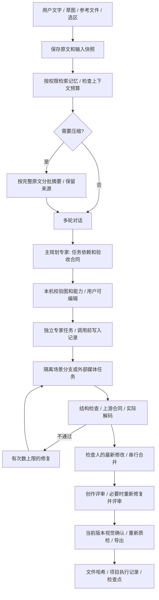

# 生产工作流与故障处理规范（3.3）

3.3 的新增检查、场景权限和交付语义见 [深度检查记录](QUALITY_AUDIT_3_3.md) 与
[ADR 0004](adr/0004-evidence-and-scene-delivery.md)。执行历史追加保留，摘要通过记忆 epoch
防止过期回写；冷恢复和人工批准绑定对象、时间线、单位及呈现设置的交付版本。

这份规范对应代码和回归测试。它描述插件可执行的控制机制，并列出需要外部模型与人工验证的边界。架构决策见 [ADR 0003](adr/0003-reliable-production-lifecycle.md)。

## 1. 对话、规划和执行的边界

聊天不自动修改场景。生产任务开始时冻结项目、会话、附件和区域；用户在等待过程中修改附件面板，不能悄悄改变已在运行的请求。对话、规划、代码、修复、摘要、记忆提取、图像评审均检查输入预算。提供商的 `context_window` 还要扣除输出 token 和安全余量。图像使用 `vision_tokens_per_image` 预留，不把 base64 长度当成文字 token。估算不等同于供应商 tokenizer。

超出预算会明确失败并保留当前原文。模型输入中明确指出预算导致的历史缺省，不能假装完整回忆。摘要失败使用有标签的抽取式降级。每轮最多三次压缩调用，避免维护任务无限占用成本。

## 2. 记忆生成、更新与遗忘

| 资料 | 权威来源 | 生命周期 | 检索规则 |
|---|---|---|---|
| 原始对话 | 用户/助手各自角色 | 持久保存；项目删除时清除 | 近期原文 + 带覆盖范围的摘要 |
| 临时意图 | 已核对的用户引用 | 会话范围，默认一天有效 | 会话内；过期不能当事实 |
| 项目决策 | 来源引用 + 用户确认 | 版本化；冲突可审阅 | 同项目；覆盖同键的个人默认值 |
| 个人习惯 | 用户明确确认 | 跨本机项目；可关闭 | 不能覆盖本项目/本轮指令 |
| 执行情景 | 宿主实际结果 | 按项目/运行/任务保存成败和尝试数 | 按任务相关性回忆；不泛化成永久规则 |
| 结构观察 | 宿主质量检查 + 指纹 | 有时间范围的历史事实 | 不能等同于当前状态或审美结论 |

候选生成必须引用本会话中真实、完整的用户发言，不能引用助手建议、失败记录或外部文件指令。相同键值的重复提取是幂等的；新的独立用户证据合并入现有记录并提高 revision，保留原先权威状态。候选不会因为被重复提取就自动变成已确认事实。

冲突按规范化 key 比较，不声称理解任意同义句。相同 key 的不同值保留为待解决冲突。确认新值会把旧值标为 superseded 并保存修订历史。并发窗口使用 revision 比较，拒绝过时确认。检索先做项目和会话隔离，再应用会话 > 项目 > 个人的优先级，最后使用英文词/中文双字相关度、重要性和时间排序。无关的历史质检不应挤占每一轮上下文。

重要度至少 0.9 的已确认 constraint 视为用户固定约束；空间不足时要求提高预算或明确修订，不能静默丢弃。模型提取的重要度必须是有限数值。冲突作为未解决的参考数据进入上下文，不获得指令权限。

拒绝或遗忘会记录 scope/key/value 摘要指纹，阻止后台重复提取相同事实。遗忘清除正文及版本，并清理可能重复该事实的派生摘要。原始对话和用户创建的数据库备份分别保留；彻底清除项目使用 **Erase Project Conversations & Memory**。记忆审阅界面也能查看执行情景。SQLite v1 自动迁移到 v2；新版本数据库不会被旧插件静默降级。

## 3. 任务依赖、写入范围与自检

主规划者输出 DAG，专家不能直接标记自己完成。缺失依赖、自环、环路、重复 ID、未知专家、非法合同和矛盾边界在执行前拒绝。独立根部件必须使用不同 `part_id`；共享场景操作串行，避免两个专家同时修改同一资产。一个失败只阻断依赖它的任务，独立分支仍可完成。人工重试保留成功任务、既有调用数和修复预算。

合同支持顶点/面数、材料/UV、闭合网格、尺寸/空间边界、指定对象、装配锚点/容差、骨骼和动画要求。整数计数不能使用小数，最大值不能小于最小值。最终导出必须依赖所有生成几何的任务。对前面部件的要求按稳定资产 ID 重新作用于相应部件，不能通过在导出步骤使用空合同逃过质量检查。

代码先在独立 Blender 进程运行。生成结果在主进程的临时场景重新检查经过修改器求值的网格，不能只看基础顶点数或信任子进程报告。检查实际有限坐标、面积、相邻面朝向、UV 数值、逐面材质分配、空间约束等。没有被当前用途要求的闭合拓扑仅作为警告，允许开放布面等合理几何。

创作评审失败后，允许的自动修复会生成新候选；新候选即使结构通过，也必须再执行一次创作评审。达到上限仍不合格时阻断下游。候选输出透视、背面、顶面 Workbench 视图；材质合同额外产生 Cycles 工作室材质预览，动画合同产生标记帧预览。视觉模型接收预算容许的视图，并记录实际数量。有限证据不代表最终灯光、全部动画帧或风格语义通过。人工视觉确认默认开启，绑定对象与场景设置的当前交付版本。

## 4. 人工编辑与场景提交

运行开始、生成结束、合并前、视觉确认及导出都会检查相关版本。指纹包含网格、UV、权重、材质节点、Geometry Nodes、关键帧/驱动、NLA、骨骼和常见属性。时间范围、当前帧、帧率和单位也在提交前比较。人工修改导致冲突时保留候选文件，当前源对象不被替换。

引用范围之外的父对象、约束目标或节点对象必须显式加入任务范围，避免后台副本带入另一份不可追踪的依赖。合并先校验全部候选，再统一替换引用；引用更新失败时尝试恢复仍存在的原始对象。临时校验失败的新增对象及无引用的数据块会清理。

顶点区域编辑要求保持对象集合、顶点/面/边拓扑、整体变换、全局动画/约束/修改器。区域外的顶点、权重、形态键坐标和面 UV 不能变化。通过后只为该已验证的区域推进指纹，使多步骤局部编辑可持续执行。任意 Geometry Nodes、贴图文件及第三方数据类型的完整等价性仍不是数学证明；精修范围越复杂，越需要预览与人工验收。

## 5. 多模态数据与中断恢复

Bridge 的依赖产物携带内容哈希，经验证后上传真实字节，返回 asset ID。独立子任务仍接收原任务的依赖结果；输出是可检查的文件描述，不是远程不可读的本地路径。原生无条件生成协议不声称支持图像/3D 条件输入；显式附件需要具备对应能力的桥接器。图片实际解码，视频/音频由 Blender 导入，3D 经原生检查。失败导入会移除本次新增 VSE 片段和对象，并恢复先前选择。

| 中断位置 | 持久证据 | 恢复行为 |
|---|---|---|
| 请求发出前 | dispatches.json 中的调用占用 | 保留预算，不虚构远端是否接受 |
| POST 返回任务 ID 后 | remote-job.json + 提供商/模型/状态 URL | Bridge/Meshy 查询已有 ID，不重发生成 POST |
| POST 返回前超时 | submitting，无可信 ID | 显式标注不确定；阻止自动重发 |
| 输出已下载 | 路径、字节数、SHA-256 | 验证原文件后继续导入 |
| 场景检查点已保存 | 资产指纹、任务结果、附件快照、修复计数 | 场景和产物一致才恢复；已成功任务跳过 |
| 用户改写或移走产物 | 哈希不匹配/缺失 | 拒绝使用旧 PASS 恢复 |

已知任务恢复使用 GET。Meshy 的 preview 与 refine 是两个可能计费的提交；如果只有 preview 已知而 refine 尚未明确提交，恢复不会擅自创建新的 refine。已提交但没有 ID 的任务需要检查供应商记录。插件不宣称对不支持幂等性的外部服务提供 exactly-once 语义。

## 6. 发布与验收

CI 覆盖 Windows/Linux/macOS 的 Python 3.10/3.13，以及 Linux Blender 3.6.23、4.2.23、4.5.14、5.1.2、5.2.2 和 macOS Apple silicon 5.2.2。每个 Blender 版本都测试真实 ZIP 安装，4.2+ 还安装扩展并运行扩展包内的 HTTP 与场景 worker。独立配置和打包目录避免并行验证污染环境。下载归档校验 SHA-256，打包规范化换行符以保证跨平台可重复构建。

源代码测试、安装测试、供应商协议测试与真实付费服务质量是不同证据。仓库 Actions 页面与上传的结果 JSON 才是对应提交的执行结果。所有显式失败都必须修复后再提交；不能以跳过测试或降低检查要求把矩阵变绿。
