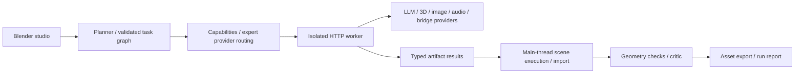

# Expert Studio architecture

Status: Accepted for the 3.0 implementation, based on the requested multi-model studio.

## Requirements

Keep existing creative tools; add explicit expert roles, dependency-checked plans,
capability-based provider routing, generated media imports, cancellation and truthful
failure reporting. Support Python 3.10 (Blender 3.6) and newer without third-party
Python dependencies. Validate the actual host version and publish the limits of coverage.

## Decision

Use one modular add-on with a Blender-independent core. An external Python process
per provider request performs blocking HTTP. Blender timers poll the process and
perform all scene mutations on the main thread. Expert tasks share typed artifacts
and a directed acyclic graph; scene-mutating experts execute serially to avoid races.
Each expert may route to a different model. No assumption that every provider supports
every modality, and no advertised universal world-model protocol.

## Trade-offs

Processes add small startup overhead but avoid persistent Python threads in Blender
and can be terminated during a slow provider call. Serial scene changes are less
parallel but make ownership and task failure understandable. The Python guard is
defense in depth, not an OS sandbox; native Blender calls cannot be interrupted by
a Python line deadline. Trusted providers and code review remain necessary.

A generic asynchronous jobs bridge covers video and world models whose protocols
vary. It requires a server implementing the documented contract; it is not a native
integration with every vendor. Native adapters are validated against local protocol
fixtures; live model quality requires the user's chosen service and credentials.

References: https://docs.blender.org/api/main/info_gotchas_threading.html
