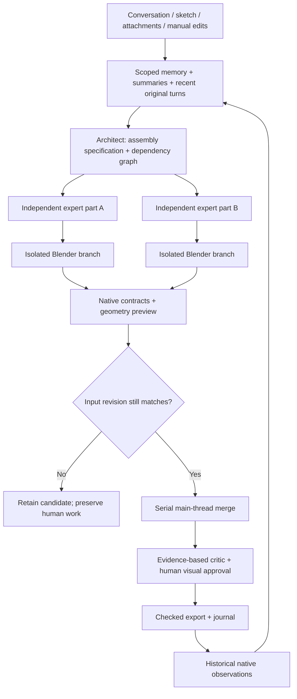

# Persistent agent platform and isolated scene branches

Status: Accepted for 3.1; supersedes the single-run and live generated-code execution portions of ADR 0001.

The expanded requirement is persistent multi-turn, personalized multi-model production with human co-editing. Prompt-only specialist labels and in-memory chat pruning cannot provide durable provenance, conflict detection or reliable parallel scene editing.

We keep a Blender-independent SQLite memory service, immutable raw turns, source-linked semantic summaries and versioned scoped memories. Model extraction proposes candidates, explicit user decisions promote durable beliefs, and host-verified structural observations have a separate provenance path. Scoped lexical retrieval is budgeted and honestly named. Backup and full project erasure are part of the lifecycle.

Independent part tasks execute through separate HTTP workers and Blender background branches. The source object graph is copied; generated code has a bounded process lifetime. Native checks and a render provide evidence before serialized host commits. Optimistic content checks and region invariants detect common human editing conflicts. Shared operations are serialized. Up to two production workflows and four independent lanes per workflow are bounded explicitly.

This costs process startup time and duplicate data storage, but failed generation does not require pretending that arbitrary in-process Python mutations are fully reversible. It is still not an operating-system security sandbox. Complex external datablocks and third-party systems are not assumed perfectly fingerprinted. Structural tests do not establish aesthetic quality; the default human gate remains explicit.

Image-aware chat sends real image bytes. Async Jobs Bridge v2 uploads conditioned assets, replacing metadata-only local file references. Native text-only adapters reject unsupported binary conditioning. Proactive assistance is local and read-only by default; model calls and scene changes remain part of user-started conversations/workflows.

Cold recovery requires a matching saved scene and preserved artifacts. It does not resend pending billed jobs automatically. Cross-version compatibility is a code path plus a test matrix, not a substitute for actual execution evidence.
